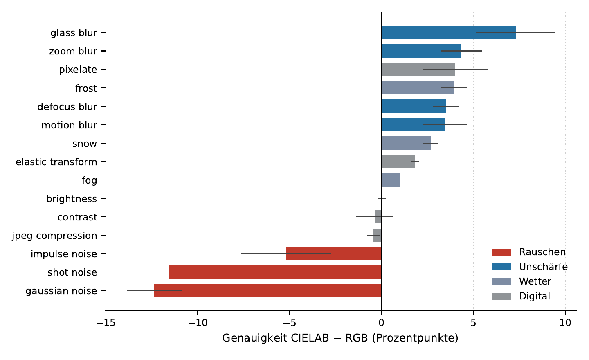

# Evaluating the Impact of Alternative Color Spaces on Image Classification



*Averaged over all fifteen corruptions of CIFAR-10-C, CIELAB and RGB are
indistinguishable. Broken down by corruption type, they differ by up to twelve
percentage points — CIELAB loses on every noise corruption and gains on every
blur corruption. The two effects cancel in the mean.*

**Bachelor thesis, University of Bamberg, Chair of Explainable Machine Learning (2026).**
Full text: [`thesis/2026_Ngansop_Bewertung-alternativer-Farbraeume.pdf`](thesis/2026_Ngansop_Bewertung-alternativer-Farbraeume.pdf)
(in German, 80 pages).

## Abstract

Almost all computer vision models process images in the RGB color space — a
choice determined by acquisition hardware rather than by the task. Its three
channels are strongly correlated, since a change in illumination shifts all of
them at once. Decorrelated color spaces such as CIELAB separate luminance from
chrominance by construction, which suggests that they should make a network more
robust to illumination-related corruptions.

This thesis tests that hypothesis. Two architectures — a ResNet-18 and a VGG-11 —
are trained from scratch on CIFAR-10 in four input representations (RGB, CIELAB,
HSV and grayscale) under otherwise identical conditions, each replicated across
five random seeds and evaluated on the fifteen standard corruptions of
CIFAR-10-C. Three further experiments complement this comparison: an eigenvalue
analysis of the learned first-layer filters, a variation of the normalization
layer across three levels, and a targeted manipulation of the input
normalization. The replication on the second architecture follows four
predictions registered in writing beforehand.

The hypothesis is not supported. CIELAB leads RGB by 0.21 percentage points on
illumination-related corruptions, a difference that changes sign across seeds
and is smaller than the spread between two runs of the same condition; after
correction for multiple testing, no robustness comparison between color spaces
remains significant, and the result carries over to the second architecture. The
grayscale control, by contrast, loses 6.97 percentage points in every
configuration, confirming that the design is sensitive enough to detect a
genuine difference. The filter analysis explains why: a network trained on RGB
constructs a luminance-chrominance decomposition in its first layer by itself,
independently of the input format.

The aggregate null result nevertheless conceals two opposing effects. Broken
down by corruption type, CIELAB loses 9.72 percentage points on noise and gains
4.64 on blur, consistently across all seeds; the two cancel in the mean, and the
same pattern reappears on the second architecture with almost twice the
amplitude. A targeted experiment identifies the cause: unifying the per-channel
scaling of the input normalization — leaving the centering untouched — reduces
the amplitude of the trade-off by about sixty percent, while the RGB control
condition remains unchanged. The dominant effect, finally, concerns neither the
color space nor the architecture as such: whether a normalization layer is
present, and which one, changes robustness by roughly six percentage points in
both architectures — some ten times the effect of the input format.

The input color space therefore changes little about *what* a network learns,
but a great deal about *how* a corruption appears before the network processes
it — and that effect arises mostly in the normalization that follows the color
space transformation, a step usually treated as neutral. For robustness, the
architecture is the more effective lever.


Bachelor's thesis project — University of Bamberg, Chair of Explainable Machine
Learning. Supervised by Sebastian Dörrich, M.Sc. and Prof. Dr. Christian Ledig.

Does the choice of input color space (RGB, HSV, CIELAB, grayscale) change how
well a CNN learns and how robustly it generalizes to corrupted images?

---

## Research question and hypothesis

**Question.** RGB channels are strongly correlated: a change in illumination
shifts R, G and B together. Color spaces such as CIELAB separate luminance (L\*)
from chrominance (a\*, b\*) by construction. Does feeding a network a
decorrelated representation make it more robust — in particular to
illumination-related corruptions?

**Hypothesis.** CIELAB should improve robustness to brightness, fog and
contrast corruptions, because luminance is an explicit, separate channel.

**Status.** Not supported. The difference is smaller than the spread between
two runs of the same condition, does not survive correction for multiple
testing, and does not appear on a second architecture. See [Results](#results).

---

## Experimental setup

| | |
|---|---|
| Dataset | CIFAR-10 (50 000 train / 10 000 test) |
| Robustness benchmark | CIFAR-10-C — 15 standard corruptions × 5 severities |
| Architectures | ResNet-18 (timm, adapted for 32×32) and VGG-11 |
| Normalization layers | BatchNorm, GroupNorm (32 groups), none |
| Input normalization | z-score, min-max, centered, unified scaling |
| Color spaces | RGB (baseline), CIELAB, HSV, grayscale (3-channel duplicate) |
| Training | 50 epochs, Adam, StepLR (step 25, γ = 0.1), batch 32, from scratch |
| Seeds | 5 (0, 1, 2, 3, 42) per condition |

Color conversions use `scikit-image`; all channels are rescaled to [0, 1]
before normalization (see `src/color_dg/color_spaces/converter.py`).

The four additional corruptions shipped with CIFAR-10-C (speckle noise,
gaussian blur, spatter, saturate) are evaluated separately and are not part of
the headline metric.

---

## Results

### Clean accuracy — ResNet-18 + BatchNorm, mean ± std over 5 seeds

| Color space | Test accuracy |
|---|---|
| CIELAB | 92.76 % ± 0.14 |
| RGB | 92.58 % ± 0.13 |
| HSV | 92.40 % ± 0.08 |
| Grayscale | 90.95 % ± 0.22 |

### Robustness — CIFAR-10-C, 15 standard corruptions

| Color space | mCA | mCA illumination (3) | mCA rest (12) |
|---|---|---|---|
| CIELAB | 71.79 % ± 0.68 | 82.08 % ± 0.51 | 69.22 % ± 0.74 |
| HSV | 71.73 % ± 0.68 | 81.40 % ± 0.36 | 69.32 % ± 0.77 |
| RGB | 71.66 % ± 0.52 | 81.87 % ± 0.36 | 69.11 % ± 0.58 |
| Grayscale | 64.59 % ± 0.34 | 80.66 % ± 0.20 | 60.57 % ± 0.41 |

### Main findings

**1. The hypothesis is not supported.** CIELAB leads RGB by 0.21 pp on
illumination-related corruptions (p = 0.31, 3 of 5 seeds). The per-seed
differences change sign, and the standard deviation between five runs of the
*same* condition (0.36 pp) exceeds the measured effect. After Holm correction
across the nine pairwise comparisons, no robustness comparison remains
significant.

**2. Convergence speed is unaffected too.** CIELAB and RGB reach the 85 %
threshold at exactly the same epoch (7.80 ± 0.84). The grayscale control needs
10.00 ± 1.00 epochs (p = 0.029, slower at all five seeds) — the measurement can
detect a difference in learning speed when one exists.

**3. The aggregate hides a trade-off.** Broken down by corruption type, CIELAB
loses 9.72 pp on noise and gains 4.64 pp on blur — consistently across all
seeds (0/5 and 5/5), and both surviving Holm correction. The two nearly cancel
in the mean. The same pattern appears on VGG-11 with almost twice the
amplitude.

**4. The cause is the input normalization, not the color transform.** CIELAB's
chroma channels have very small standard deviations (0.0398 and 0.0631 vs
0.2426 for L\*), so per-channel standardization amplifies them four- to sixfold
relative to an RGB channel. Unifying the scaling — dividing all channels by
σ(L\*), leaving the centering untouched — reduces the amplitude of the
trade-off from 14.35 to 5.67 pp, while the RGB control condition changes by
only −0.54 pp.

**5. Networks build their own luminance-chrominance decomposition.** An
eigenvalue analysis of the first-layer channel weights shows an effective rank
of 2.63 for RGB-trained networks versus 2.76 for CIELAB-trained ones, with the
principal axis at |cos| = 0.994 to the luminance direction (1,1,1) — against
1.20 for the raw pixel colors and 1.37 for the grayscale control. A
decorrelated input therefore saves the network work it does anyway.

**6. The normalization layer matters roughly ten times more than the color
space.** Switching ResNet-18 from BatchNorm to GroupNorm improves robustness by
6.4–6.9 pp for every color space; removing the normalization layer entirely
from VGG-11 costs 5.75–6.12 pp. Color space differences in the same setup stay
below one percentage point.

**7. Grayscale loses everywhere** — 6.97 pp on the 15 corruptions, every seed,
in every configuration. This negative control confirms that the design detects
a genuine difference in color content when one exists.

---

## Reproducing the results

The pipeline runs in five steps. Steps 1–3 produce the raw results, steps 4–5
turn them into the numbers and figures reported in the thesis.

### 0. Setup

```bash
conda create -n color_dg python=3.11
conda activate color_dg
pip install -e ".[dev]"
```

CIFAR-10 downloads automatically on first use. CIFAR-10-C must be fetched
separately from [Zenodo](https://zenodo.org/record/2535967) and extracted to
`data/CIFAR-10-C/`.

### 1. Compute the normalization constants

```bash
python scripts/compute_cifar10_stats.py --data_root ./data
```

Produces the per-channel means and standard deviations of each color space —
the values in Table 2 of the thesis, and the input to every normalization
scheme.

### 2. Train

One run per (color space × seed). The config file selects the color space, the
architecture, the normalization layer and the input normalization scheme.

```bash
python -m scripts.train_model --config configs/exp_lab.yaml \
    --seed 0 --output_dir runs/resnet18_bn/exp_lab_seed0
```

The batch scripts in `scripts/run_*.sh` launch a full condition across all five
seeds.

### 3. Evaluate on CIFAR-10-C

```bash
python -m scripts.eval_cifar10c \
    --cifar10c_root data/CIFAR-10-C \
    --results_dir runs/resnet18_bn --seed 0 \
    --output_dir runs/resnet18_bn/cifar10c_seed0
```

Writes `results_raw.csv` (accuracy per corruption × severity) and
`corruption_summary.csv`.

### 4. Statistics

```bash
python scripts/verify_stats.py
```

Paired t-tests and Wilcoxon tests across seeds, Cohen's d for paired data,
Holm–Bonferroni correction, per-corruption breakdown and the noise/blur
subsets. **This single script produces most of the numbers in Chapter 6 of the
thesis.**

### 5. Filter analysis and plots

```bash
python -m scripts.analyze_conv1_multi   # eigenvalues, effective rank
python scripts/plot_cifar10c.py         # per-corruption figures
python scripts/plot_results.py          # accuracy curves
```

---

## Where each result in the thesis comes from

| Thesis | Result | Produced by |
|---|---|---|
| Fig. 1, 2 (§4.1) | Color channels, channel correlations | `notebooks/01_visualize_colorspaces.ipynb` |
| Tab. 2 (§5.2.2) | Normalization constants | `scripts/compute_cifar10_stats.py` |
| Tab. 5 (§6.1) | Clean accuracy | `runs/resnet18_bn/`, `runs/resnet18_bn_phase4/` |
| Fig. 5 (§6.1.1) | Convergence curves | `runs/resnet18_bn_phase4/*/metrics.csv` |
| Tab. 6 (§6.2) | mCA, main hypothesis | `runs/resnet18_bn/cifar10c_seed*/` |
| Fig. 6, Tab. 7 (§6.3) | Trade-off by corruption type | same runs, `results_raw.csv` |
| Fig. 7, Tab. 8 (§6.4) | Unified channel scaling | `runs/resnet18_bn_uniscale/` |
| Fig. 8, Tab. 9 (§6.6) | BatchNorm vs GroupNorm | `runs/resnet18_gn/` |
| Fig. 9, Tab. 10 (§6.7) | Learned conv1 filters | `runs/aggregate/conv1_analyse_multi.txt` |
| Tab. 11, Fig. 10 (§6.8) | VGG-11 replication | `runs/vgg11_bn/`, `runs/vgg11_nonorm/` |
| §6.9.3 | Alternative normalization schemes | `runs/resnet18_bn_normschemes/` |
| §6.9.4 | Grayscale negative control | `runs/resnet18_bn_gray_control/` |
| App. B | Pre-registered predictions | `PREREGISTRATION_vgg11.md` |

Every statistical test in Chapter 6 can be regenerated with
`python scripts/verify_stats.py`.

---

## Repository structure

```
src/color_dg/
├── color_spaces/     conversions + torchvision transforms
├── data/             CIFAR-10 loaders, color-space aware
└── models/           ResNet-18 and VGG-11, parameterized normalization
configs/              one YAML per experiment
scripts/              training, evaluation, analysis, plotting
tests/                unit tests for color conversions
notebooks/            color space visualization (Figures 1 and 2)
docs/                 statistical analysis, literature review
logs/                 raw training logs
runs/                 experiment outputs (see below)
```

### Experiment directories

| Directory | Architecture | Normalization layer | Input normalization | Color spaces | Seeds |
|---|---|---|---|---|---|
| `runs/resnet18_bn` | ResNet-18 | BatchNorm | z-score | RGB, LAB, HSV | 5 |
| `runs/resnet18_bn_phase4` | ResNet-18 | BatchNorm | z-score | 4 | 5 |
| `runs/resnet18_bn_gray_control` | ResNet-18 | BatchNorm | z-score | grayscale | 1 |
| `runs/resnet18_bn_normschemes` | ResNet-18 | BatchNorm | min-max, centered | RGB, LAB | 3 |
| `runs/resnet18_bn_uniscale` | ResNet-18 | BatchNorm | unified scaling | RGB, LAB | 5 |
| `runs/resnet18_gn` | ResNet-18 | GroupNorm | z-score | 4 | 5 |
| `runs/vgg11_bn` | VGG-11 | BatchNorm | z-score | 4 | 5 |
| `runs/vgg11_nonorm` | VGG-11 | none | z-score | 4 | 5 |
| `runs/aggregate` | — | combined summaries and conv1 analysis | | | |
| `runs/legacy/` | — | early exploratory runs, superseded | | | |

The reference numbers reported above come from `runs/resnet18_bn` for RGB,
CIELAB and HSV, and from `runs/resnet18_bn_phase4` for grayscale. In
`runs/vgg11_*`, the `cifar10c4_seed*` subdirectories cover all four color
spaces and are the ones used.

Trained checkpoints (`*.pth`) are not versioned; rerun the training commands
above to regenerate them.

---

## Known limitations

- Best-epoch selection uses the test set (no separate validation split), and
  CIFAR-10-C is built by corrupting those same 10 000 test images. Absolute
  accuracies are therefore mildly optimistic; the bias is identical across all
  conditions and does not affect the reported comparisons.
- Both architectures are convolutional; nothing is established for models
  without convolution.
- Single resolution (32×32) and single dataset (CIFAR-10).
- The per-corruption breakdown is a post-hoc analysis, not a pre-registered
  hypothesis. The VGG-11 replication is pre-registered.
- The GroupNorm advantage is known to depend on batch size and is reported here
  for batch size 32. The comparison *with vs. without* a normalization layer is
  not subject to that caveat.
- Under unified scaling, CIELAB leads RGB on illumination corruptions at all
  five seeds (+0.91 pp, p = 0.071). This is below significance but consistent,
  and suggests the null result may be tied to the standard preprocessing rather
  than to the color space itself.

---

## Author

Giresse Ngansop — University of Bamberg
`giresse-ginola.ngansop-njinkap@stud.uni-bamberg.de`


## Licence

| What | Licence |
|---|---|
| Source code | [MIT](LICENSE) |
| Thesis text and figures | [CC BY 4.0](LICENSE-THESIS) |

You may share and adapt the thesis, including commercially, provided you give
credit. Suggested attribution and the full terms are in
[`LICENSE-THESIS`](LICENSE-THESIS).

**Exception:** the title page carries the logos of the University of Bamberg and
of the Chair of Explainable Machine Learning. These belong to their respective
owners and are not covered by the CC BY licence.

